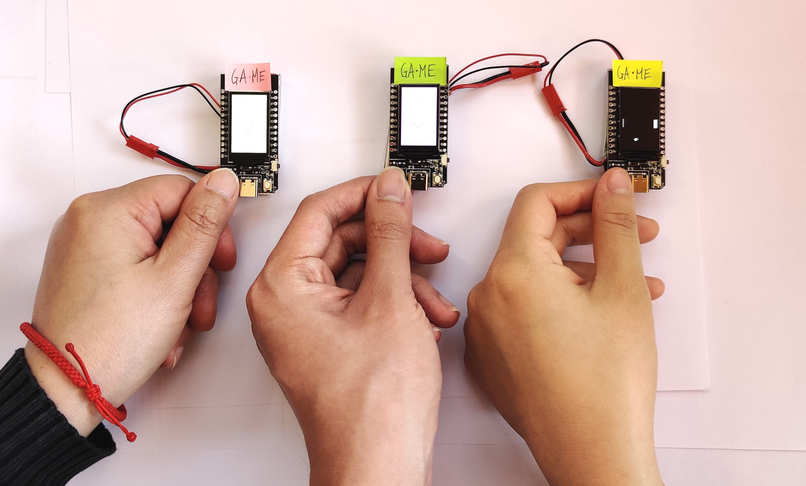

# Ga-Me <!-- omit in toc -->
## A game of split worlds

[Video Demo]() <!-- TODO -->

Eight hours of sleep, eight hours of school, and eight hours of free time. That's how the saying goes. In the fast-paced world we live in today, sometimes this split isn't so clear.

Ga-Me is a simple pong game split across three portable devices which seeks to explore the struggle between these disparate goals and lives of a human. Especially during a busy time like finals season, students may feel that they struggle to keep the split between these parts of their schedule. They must fight for leisure and sleep.

On the surface, the main attraction of Ga-Me is that traditional pong game. This is "work", which may be fun, but players have no choice but to keep hitting that ball. However, when the ball isn't on a player's screen, a generative artistic tool appears. Via a hidden touch-sensitive interface, users can interact with this system to produce stunning and unique masterpieces which take inspiration from the human fingerprint. This represents a person's free time. While on this screen, players can still use the buttons to control the Pong game, which is always visible on one of the three screens at any given moment. And thus emerges the juggling act of balancing these worlds.

The left and right players each control three paddles -- one on each screen. The middle player can influence the movement of the ball, allowing them to aid or sabotage the other two players for his/her own benefit. But here's the catch: if the ball enters into your screen, your artwork is deleted. You'll have to start over next time. Thus, players must carefully balance both sets of controls to fend off the ball as they produce their works of art.

# Table of Contents <!-- omit in toc -->
<!-- TODO -->

# Setup
## Hardware
This project used three TTGO T-Display ESP32 boards with built-in TFT LCDs. Note that a USB C cable is recommended for programming these boards. A lithium polymer battery was used to power each board via the JST connector. The batteries were attached securely to the boards using Plasti-Tak. In the image above, the cables for this were positioned so as to look like lanyards, although they should not actually be used as such.

Feel free to add some decoration at the top of the device, although avoid materials which may interfere with the antenna present there. Avoid excessive covering of the device otherwise unless a fan is installed, as the microcontroller gets hot rather when running the code here. In addition, if a covering is use, care must be taken to ensure the artistic control interface is still available (see [Controlling the Art](#TODO) below).

## Software Dependencies
- Arduino 1.8.13 or similar
  - TFT_eSPI library for TTGO T-Display (see [here](https://github.com/Xinyuan-LilyGO/TTGO-T-Display))

## Preparation
1. For each device, upload [GetMAC.ino](ESP32/GetMAC/GetMAC.ino) to the board.
2. Note down the MAC address output to the serial monitor.
3. In `ESP32/GaMe` create a file named `common.h` with the MAC addresses as shown below (in this example, all three devices output `AB:CD:EF:12:34:56` when `GetMAC` was run).

        #define MAC1 {0xAB, 0xCD, 0xEF, 0x12, 0x34, 0x56}
        #define MAC2 {0xAB, 0xCD, 0xEF, 0x12, 0x34, 0x56}
        #define MAC3 {0xAB, 0xCD, 0xEF, 0x12, 0x34, 0x56}

      Note: `MAC1` corresponds to the "left" panel of the game, `MAC2` is the center panel, and `MAC3` represents the "right" panel.

## Installation
1. In [GaMe.ino](ESP32/GaMe/GaMe.ino), change the definition of `BOARD_ROLE` to define it as `1`.
2. Then, connect board #1 (corresponding to `MAC1` from [above](#preparation)) and upload the code.
3. Next, follow the same procedure for board #3, defining `BOARD_ROLE` to equal `3` and upload it to the board with `MAC3` as its MAC address.
4. Finally, repeat the procedure for board #2. Note that board #2 is configured last as it contains the code which will start the Pong game.
   - If the boards power on in a different order, simply press the `RESET` button on board #2 to start the game.

## Configuration
The gameplay of the pong game can be adjusted by changing the following macros:

| Macro | Type  | Function  |
| ---   | ---   | ---       |
|`PADDLE_HEIGHT`|positive integer|controls the size of the paddles|
|`PADDLE_VEL`|positive integer|controls how quickly the paddles and ball can be moved via button inputs|
|`BALL_RADIUS`|positive integer|controls the size of the ball|
|`VEL_X_MIN`|positive integer|controls the minimum possible starting horizontal velocity of the ball|
|`VEL_X_MAX`|positive integer|controls the maximum possible starting horizontal velocity of the ball|
|`VEL_Y_MIN`|positive integer|controls the minimum possible starting vertical velocity of the ball|
|`VEL_Y_MAX`|positive integer|controls the maximum possible starting vertical velocity of the ball|
|`GAME_TICK`|positive decimal|changes the period of the control loop -- increasing this value decreases the heat generated by the system and may extend battery life, but can lead to noticeable input lag and choppy animations if set too high|

# Controls
## Controlling Pong
### Players 1 (left) and 3 (right)
|Input|Action|
|---|---|
|Left Button|move paddle down|
|Right Button|move paddle up|
 
### Player 2 (center)
Note that Player 2 cannot change the ball's direction completely (i.e., from moving left to moving right). However, he/she can speed up or slow down the ball's **horizontal** movement, changing the path of the ball. For example, pressing the left button while the ball is already moving leftwards will cause it to speed up horizontally, moving at a "flatter" angle.
|Input|Action|
|---|---|
|Left Button|move ball towards left|
|Right Button|move ball towards right|
 
## Controlling the Art
### All Players
The generative art display will appear when the ball is not currently on the player's screen as long as they did not just lose the pong game (i.e., the ball moved past their final paddle).
- The interface is meant to be loosely defined so that players can discover their own methods of interacting with the generative art.
- Place your fingers along the left and right edges of the screen and discover the possibilities yourself.

  
Spoiler: generative art interface details

  The generative art is informed by capacitive touch sensing on pins 2 and 32. Pressing on the left will increase the rate of rotation of the currently-generating trail about the center of the screen in the counterclockwise direction. Pressing on the right will increase the rate of rotation in the clockwise direction.

  This interface is analog, so pressing with more strength will increase the rate of rotation in that respective direction.

